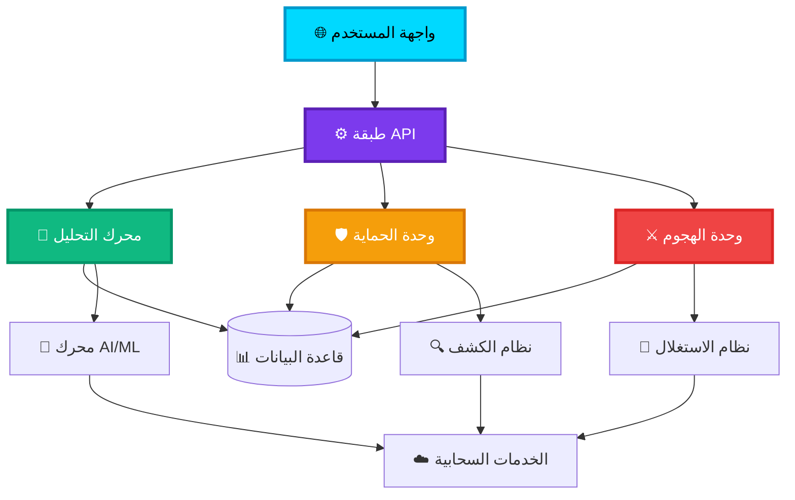
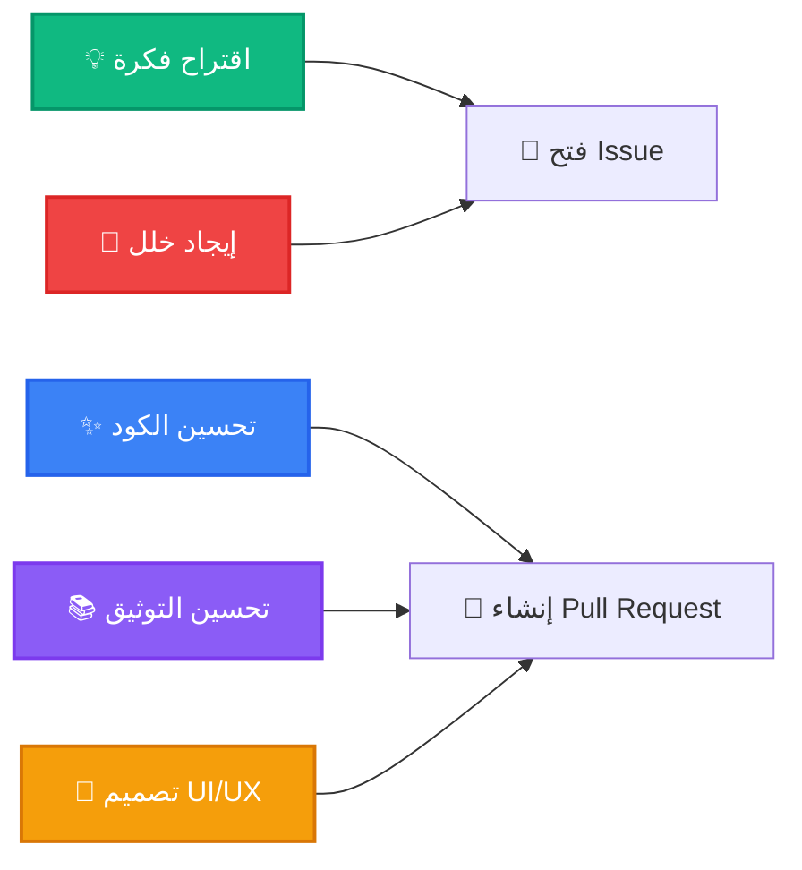
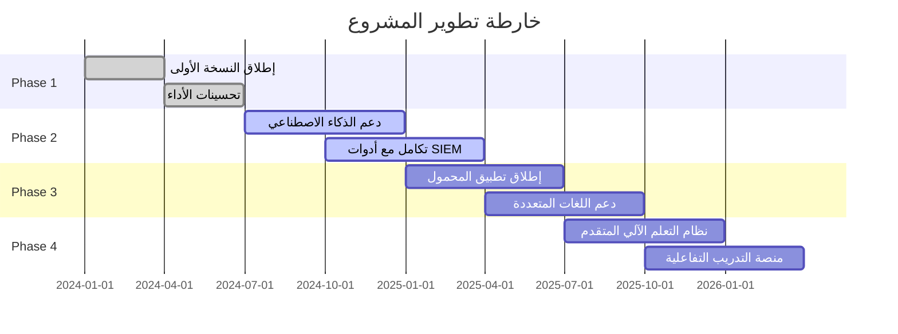

<div align="center">

# 🧞‍♂️ DW Project - مشروع المارد الرقمي


[](https://github.com/asrar-mared/dw-project/stargazers)
[](https://github.com/asrar-mared/dw-project/network)
[](LICENSE)
[](https://github.com/asrar-mared/dw-project/graphs/commit-activity)


</div>

---

## 📑 فهرس المحتوى

<div align="center">

| القسم | الوصف |
|:---:|:---|
| 🎯 | [**نظرة عامة**](#-نظرة-عامة) |
| ⚡ | [**المميزات الرئيسية**](#-المميزات-الرئيسية) |
| 🏗️ | [**معمارية المشروع**](#️-معمارية-المشروع) |
| 🚀 | [**التثبيت والإعداد**](#-التثبيت-والإعداد) |
| 🛠️ | [**الأدوات والتقنيات**](#️-الأدوات-والتقنيات) |
| 📊 | [**لوحة التحكم**](#-لوحة-التحكم) |
| 🔐 | [**الأمان والحماية**](#-الأمان-والحماية) |
| 📚 | [**التوثيق**](#-التوثيق) |
| 🤝 | [**المساهمة**](#-المساهمة) |
| 📜 | [**الترخيص**](#-الترخيص) |

</div>

---

## 🎯 نظرة عامة

<div align="center">

```ascii
╔═══════════════════════════════════════════════════════════════╗
║                                                               ║
║   ██████╗ ██╗    ██╗    ██████╗ ██████╗  ██████╗      ██╗    ║
║   ██╔══██╗██║    ██║    ██╔══██╗██╔══██╗██╔═══██╗     ██║    ║
║   ██║  ██║██║ █╗ ██║    ██████╔╝██████╔╝██║   ██║     ██║    ║
║   ██║  ██║██║███╗██║    ██╔═══╝ ██╔══██╗██║   ██║██   ██║    ║
║   ██████╔╝╚███╔███╔╝    ██║     ██║  ██║╚██████╔╝╚█████╔╝    ║
║   ╚═════╝  ╚══╝╚══╝     ╚═╝     ╚═╝  ╚═╝ ╚═════╝  ╚════╝     ║
║                                                               ║
║            🧞‍♂️ المارد الرقمي للدفاع السيبراني 🧞‍♂️            ║
║                                                               ║
╚═══════════════════════════════════════════════════════════════╝
```

</div>

**DW Project** هو إطار عمل متكامل للعمليات الأمنية السيبرانية، مصمم لتوفير حلول دفاعية وهجومية شاملة للباحثين الأمنيين ومحترفي الأمن السيبراني. يجمع المشروع بين الأدوات التقليدية والحديثة في بيئة موحدة قابلة للتوسع.

<div align="center">

### 🌟 الرؤية

> *من يُتقن فنّ الدفاع الرقمي، يَحكم ساحة المعركة السيبرانية*

</div>

---

## ⚡ المميزات الرئيسية

<table>
<tr>
<td width="50%">

### 🛡️ الدفاع السيبراني
- ✅ كشف التهديدات في الوقت الفعلي
- ✅ تحليل سلوك الشبكة
- ✅ نظام استجابة تلقائي للحوادث
- ✅ جدار حماية ذكي قائم على AI
- ✅ مراقبة النقاط الطرفية

</td>
<td width="50%">

### ⚔️ العمليات الهجومية
- ✅ إطار اختبار اختراق متقدم
- ✅ أدوات استطلاع وجمع معلومات
- ✅ محاكاة سيناريوهات الهجوم
- ✅ استغلال الثغرات الأمنية
- ✅ تحليل ما بعد الاختراق

</td>
</tr>
<tr>
<td width="50%">

### 📊 التحليل والاستخبارات
- ✅ تحليل البرمجيات الخبيثة
- ✅ جمع استخبارات التهديدات
- ✅ تصور البيانات التفاعلي
- ✅ تقارير آلية شاملة
- ✅ تكامل مع MITRE ATT&CK

</td>
<td width="50%">

### 🔧 الأتمتة والتكامل
- ✅ سير عمل قابل للتخصيص
- ✅ واجهات برمجية RESTful
- ✅ تكامل مع أدوات SIEM
- ✅ نشر سحابي وموزع
- ✅ إدارة مركزية

</td>
</tr>
</table>

---

## 🏗️ معمارية المشروع

<div align="center">



</div>

### 📂 هيكل الملفات

```
dw-project/
├── 🎨 frontend/              # واجهة المستخدم (React/Vue)
│   ├── components/           # المكونات القابلة لإعادة الاستخدام
│   ├── pages/                # صفحات التطبيق
│   └── assets/               # الموارد الثابتة
├── ⚙️ backend/               # الخادم (Node.js/Python)
│   ├── api/                  # نقاط النهاية
│   ├── services/             # منطق العمل
│   ├── models/               # نماذج البيانات
│   └── utils/                # أدوات مساعدة
├── 🧠 ai-engine/             # محرك الذكاء الاصطناعي
│   ├── models/               # النماذج المدربة
│   ├── training/             # سكريبتات التدريب
│   └── inference/            # استنتاج الوقت الفعلي
├── 🛡️ defense-modules/       # وحدات الدفاع
│   ├── firewall/             # جدار الحماية
│   ├── ids/                  # نظام كشف التسلل
│   └── scanner/              # الماسح الأمني
├── ⚔️ offense-modules/       # وحدات الهجوم
│   ├── recon/                # الاستطلاع
│   ├── exploit/              # الاستغلال
│   └── post-exploit/         # ما بعد الاختراق
├── 📊 analytics/             # محرك التحليل
│   ├── visualization/        # التصورات
│   └── reporting/            # التقارير
├── 🗄️ database/             # قواعد البيانات
├── 🐳 docker/                # حاويات Docker
├── 📚 docs/                  # التوثيق
└── 🧪 tests/                 # الاختبارات

```

---

## 🚀 التثبيت والإعداد

### متطلبات النظام

<div align="center">

| المتطلب | النسخة الدنيا | الموصى بها |
|:---:|:---:|:---:|
| 🐧 نظام التشغيل | Linux/macOS/Windows | Ubuntu 22.04 LTS |
| 🐍 Python | 3.9+ | 3.11+ |
| 🟢 Node.js | 16.x | 20.x LTS |
| 🐳 Docker | 20.x | 24.x |
| 💾 الذاكرة | 8 GB | 16 GB+ |
| 💿 المساحة | 20 GB | 50 GB+ |

</div>

### 📥 التثبيت السريع

```bash
# 1️⃣ استنساخ المستودع
git clone https://github.com/asrar-mared/dw-project.git
cd dw-project

# 2️⃣ تشغيل سكريبت الإعداد التلقائي
chmod +x setup.sh
./setup.sh

# 3️⃣ تكوين البيئة
cp .env.example .env
nano .env  # قم بتعديل الإعدادات حسب بيئتك

# 4️⃣ بناء الحاويات
docker-compose build

# 5️⃣ تشغيل المشروع
docker-compose up -d

# 6️⃣ التحقق من الحالة
docker-compose ps
```

### 🎯 التثبيت اليدوي

<details>
<summary><b>👉 انقر لعرض خطوات التثبيت اليدوي</b></summary>

#### Backend Setup

```bash
cd backend
python -m venv venv
source venv/bin/activate  # Linux/macOS
# أو
venv\Scripts\activate  # Windows

pip install -r requirements.txt
python manage.py migrate
python manage.py createsuperuser
python manage.py runserver
```

#### Frontend Setup

```bash
cd frontend
npm install
npm run dev
```

#### AI Engine Setup

```bash
cd ai-engine
pip install -r requirements.txt
python train_models.py
python start_inference_server.py
```

</details>

---

## 🛠️ الأدوات والتقنيات

<div align="center">

### 🎨 Frontend Stack


### ⚙️ Backend Stack


### 🗄️ Database & Storage


### 🤖 AI & ML


### 🐳 DevOps & Cloud


### 🔐 Security Tools


</div>

---

## 📊 لوحة التحكم

<div align="center">

### 🎛️ واجهة التحكم الرئيسية


</div>

يوفر المشروع لوحة تحكم تفاعلية شاملة تتضمن:

- 📈 **مراقبة حية** للشبكة والأنظمة
- 🎯 **خرائط تهديدات** تفاعلية في الوقت الفعلي
- 📊 **إحصائيات متقدمة** مع رسوم بيانية ديناميكية
- 🔔 **نظام تنبيهات** ذكي وقابل للتخصيص
- 📝 **سجلات شاملة** لجميع الأنشطة
- 🗺️ **خرائط جغرافية** لمصادر التهديدات

### الوصول إلى اللوحة

```
http://localhost:3000/dashboard
Username: admin
Password: [كلمة المرور التي أنشأتها]
```

---

## 🔐 الأمان والحماية

<div align="center">

### 🛡️ طبقات الحماية المتعددة

</div>

| الطبقة | الوصف | الحالة |
|:---:|:---|:---:|
| 🔒 | **تشفير end-to-end** لجميع الاتصالات | ✅ |
| 🔑 | **مصادقة متعددة العوامل** (MFA/2FA) | ✅ |
| 👤 | **نظام صلاحيات** متدرج (RBAC) | ✅ |
| 📝 | **تسجيل شامل** لجميع العمليات | ✅ |
| 🔍 | **مراجعة أمنية** دورية للكود | ✅ |
| 🛡️ | **حماية من DDoS** وهجمات Brute Force | ✅ |
| 🔐 | **تخزين آمن** للبيانات الحساسة | ✅ |
| 🚨 | **نظام إنذار مبكر** للتهديدات | ✅ |

### ⚠️ ملاحظات أمنية هامة

```diff
! هذا المشروع مخصص لأغراض بحثية وتعليمية فقط
! استخدامه في بيئات إنتاجية دون إذن يعد انتهاكاً قانونياً
+ تأكد من الحصول على التصاريح اللازمة قبل الاستخدام
+ قم بتحديث جميع المكونات بانتظام للحفاظ على الأمان
```

---

## 📚 التوثيق

<div align="center">

### 📖 الموارد التعليمية

</div>

| الوثيقة | الوصف | الرابط |
|:---|:---|:---:|
| 📘 دليل البداية السريعة | للمبتدئين في المشروع | [🔗](docs/quick-start.md) |
| 📗 دليل المطور | للمساهمين والمطورين | [🔗](docs/developer-guide.md) |
| 📙 واجهة API | توثيق شامل للـ API | [🔗](docs/api-reference.md) |
| 📕 الأمثلة والحالات | أمثلة عملية تطبيقية | [🔗](docs/examples.md) |
| 📓 الأسئلة الشائعة | إجابات للأسئلة المتكررة | [🔗](docs/faq.md) |
| 📔 سياسة الأمان | إرشادات الأمان والخصوصية | [🔗](SECURITY.md) |

### 🎓 دروس فيديو

- [🎬 مقدمة للمشروع](https://youtube.com)
- [🎬 دليل التثبيت الكامل](https://youtube.com)
- [🎬 سيناريوهات عملية](https://youtube.com)

---

## 🤝 المساهمة

<div align="center">

### 💝 نرحب بمساهماتكم!


</div>

نحن نؤمن بقوة المجتمع المفتوح المصدر ونرحب بجميع أشكال المساهمة:

#### 🌟 طرق المساهمة



#### 📋 خطوات المساهمة

1. 🍴 **Fork** المستودع
2. 🌿 أنشئ فرعاً جديداً (`git checkout -b feature/AmazingFeature`)
3. 💾 احفظ تغييراتك (`git commit -m 'Add some AmazingFeature'`)
4. 📤 ادفع إلى الفرع (`git push origin feature/AmazingFeature`)
5. 🔀 افتح **Pull Request**

#### 📜 إرشادات المساهمة

- ✅ اتبع معايير الكتابة البرمجية للمشروع
- ✅ أضف اختبارات لأي كود جديد
- ✅ حدّث التوثيق عند الحاجة
- ✅ تأكد من نجاح جميع الاختبارات
- ✅ اكتب رسائل commit واضحة وموجزة

### 🏆 المساهمون الرئيسيون

<div align="center">

[](https://github.com/asrar-mared/dw-project/graphs/contributors)

</div>

---

## 📈 إحصائيات المشروع

<div align="center">


</div>

---

## 🗺️ خارطة الطريق

<div align="center">

### 🚀 الإصدارات القادمة

</div>



#### 📅 الإصدارات المخططة

- ✅ **v1.0** - الإصدار الأساسي (تم)
- ✅ **v1.5** - تحسينات الأداء (تم)
- 🔄 **v2.0** - دعم AI/ML (جاري العمل)
- 📋 **v2.5** - تطبيق المحمول (قريباً)
- 📋 **v3.0** - منصة شاملة (مستقبلاً)

---

## 🌐 المجتمع والدعم

<div align="center">

### 💬 انضم إلى مجتمعنا

[](https://discord.gg/dwproject)
[](https://t.me/dwproject)
[](https://twitter.com/dwproject)
[](https://linkedin.com/company/dwproject)

### 📧 الدعم الفني

| نوع الدعم | التواصل |
|:---:|:---|
| 🐛 بلاغات الأخطاء | [GitHub Issues](https://github.com/asrar-mared/dw-project/issues) |
| 💡 اقتراحات التحسين | [GitHub Discussions](https://github.com/asrar-mared/dw-project/discussions) |
| 📧 الدعم المباشر | support@dwproject.io |
| 💼 الاستفس
