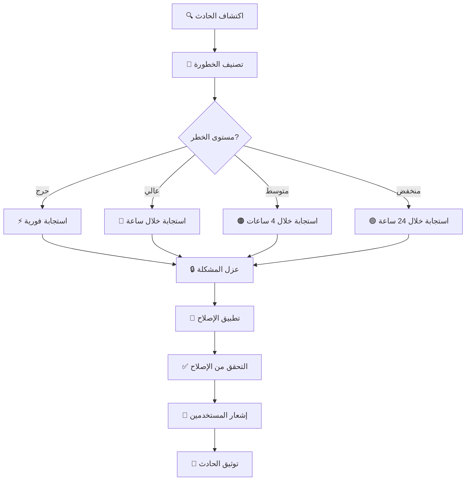

# 🛡️ سياسة الأمان - DW Project

<div align="center">


**🔒 حماية قصوى | 🔍 فحص دوري كل ساعة | ⚡ استجابة فورية**

</div>

---

## 🎯 نظرة عامة

نحن في **DW Project** نأخذ الأمان على محمل الجد. هذا المستند يوضح سياستنا الأمنية وكيفية الإبلاغ عن الثغرات الأمنية.

---

## 🔐 الإصدارات المدعومة

| الإصدار | الدعم الأمني | حالة التحديثات |
|:------:|:------------:|:--------------:|
| 2.x    | ✅ مدعوم     | 🔄 تحديثات نشطة |
| 1.5    | ✅ مدعوم     | 🔄 تصحيحات أمنية |
| 1.x    | ⚠️ محدود     | 🛑 نهاية الدعم قريباً |
| < 1.0  | ❌ غير مدعوم | ⛔ لا يوجد دعم |

---

## 🚨 الإبلاغ عن ثغرة أمنية

### 📧 التواصل الآمن

إذا اكتشفت ثغرة أمنية، يرجى عدم نشرها علناً. بدلاً من ذلك:

#### الطريقة المفضلة (خاص)
```
📧 Email: security@dwproject.io
🔐 PGP Key: [متوفر في الموقع الرسمي]
⏱️ وقت الاستجابة: 24 ساعة
```

#### عبر GitHub
- استخدم [GitHub Security Advisories](https://github.com/asrar-mared/dw-project/security/advisories/new)
- أو أنشئ Issue خاص بعلامة `security`

### 📋 معلومات مطلوبة

يرجى تضمين:

```markdown
- 📝 وصف تفصيلي للثغرة
- 🎯 خطوات إعادة إنتاج المشكلة
- 💥 التأثير المحتمل
- 🔧 الحل المقترح (إن وجد)
- 🖼️ لقطات شاشة أو فيديو (اختياري)
- 🏷️ مستوى الخطورة المقدر
```

### ⏱️ جدول الاستجابة

| المرحلة | الإطار الزمني | الإجراء |
|:------:|:-------------:|:--------|
| 1️⃣ الاستلام | < 24 ساعة | تأكيد الاستلام |
| 2️⃣ التقييم | 2-5 أيام | تحليل الخطورة |
| 3️⃣ الإصلاح | 7-30 يوم | حسب الخطورة |
| 4️⃣ النشر | فوري | تحديثات الأمان |
| 5️⃣ الإعلان | بعد الإصلاح | إشعار عام |

---

## 🏆 برنامج مكافآت الثغرات

### 💰 المكافآت المالية

| الخطورة | المكافأة | الوصف |
|:-------:|:--------:|:------|
| 🔴 حرجة | $500-1000 | ثغرات خطيرة تؤثر على النظام |
| 🟠 عالية | $250-500 | ثغرات مهمة |
| 🟡 متوسطة | $100-250 | ثغرات ذات تأثير محدود |
| 🟢 منخفضة | $50-100 | مشاكل أمنية بسيطة |

### 🎖️ شروط الأهلية

✅ **مؤهل للمكافأة:**
- اكتشاف ثغرة جديدة غير معروفة
- تقديم خطوات واضحة لإعادة الإنتاج
- الإبلاغ بشكل مسؤول
- عدم استغلال الثغرة

❌ **غير مؤهل:**
- ثغرات معروفة مسبقاً
- هجمات اجتماعية
- DDoS أو Spam
- استغلال الثغرة قبل الإصلاح

---

## 🔒 الإجراءات الأمنية

### 1️⃣ الفحص التلقائي

```yaml
🔍 كل ساعة:
  - كشف الأسرار والمفاتيح
  - فحص التبعيات
  - تحليل الكود الثابت
  - كشف البرمجيات الخبيثة
  - التحقق من الامتثال

🔍 عند كل Push:
  - جميع الفحوصات أعلاه
  - فحص Docker Images
  - اختبارات الأمان

🔍 أسبوعياً:
  - فحص شامل للنظام
  - تدقيق السجلات
  - مراجعة الصلاحيات
```

### 2️⃣ التشفير

- 🔐 **النقل:** TLS 1.3
- 🔐 **التخزين:** AES-256
- 🔐 **المفاتيح:** RSA 4096-bit
- 🔐 **كلمات المرور:** bcrypt + salt

### 3️⃣ المصادقة

```
✅ Multi-Factor Authentication (MFA)
✅ OAuth 2.0 / OpenID Connect
✅ JWT Tokens (قصيرة الأمد)
✅ Rate Limiting
✅ IP Whitelisting (عند الحاجة)
```

### 4️⃣ الصلاحيات

```
👤 Owner      → صلاحيات كاملة
👤 Admin      → إدارة وتكوين
👤 Developer  → القراءة والكتابة
👤 Viewer     → القراءة فقط
👤 Guest      → وصول محدود
```

---

## 🚫 سياسة الاستخدام المقبول

### ✅ المسموح

- اختبار اختراق في بيئات التطوير
- البحث الأمني المسؤول
- استخدام للأغراض التعليمية
- اختبار مع إذن كتابي

### ❌ الممنوع

- استغلال الثغرات في الإنتاج
- هجمات DDoS
- اختراق أنظمة دون إذن
- تسريب بيانات المستخدمين
- بيع الثغرات لجهات ثالثة

---

## 📊 سجل التحديثات الأمنية

### 2024-10-25 | v2.0.0
- ✅ إضافة فحص أمني كل ساعة
- ✅ تحسين كشف الأسرار
- ✅ تحديث التبعيات الأمنية

### 2024-09-15 | v1.5.2
- 🔒 إصلاح ثغرة XSS
- 🔒 تحديث مكتبة التشفير

### 2024-08-01 | v1.5.0
- ✅ إضافة MFA
- ✅ تحسين Rate Limiting

[📜 السجل الكامل](CHANGELOG.md)

---

## 🔍 قائمة الفحص الأمني

### للمطورين

قبل كل Commit:

```bash
☑️ فحص الكود بحثاً عن Secrets
☑️ تحديث التبعيات الضعيفة
☑️ تشغيل اختبارات الأمان
☑️ مراجعة الصلاحيات
☑️ التحقق من .gitignore
☑️ فحص Docker Images
☑️ تحديث التوثيق
```

### للمراجعين

عند مراجعة Pull Request:

```bash
☑️ فحص التغييرات الأمنية
☑️ التحقق من عدم وجود Secrets
☑️ مراجعة التبعيات الجديدة
☑️ اختبار السيناريوهات الأمنية
☑️ التأكد من اجتياز جميع الفحوصات
☑️ مراجعة صلاحيات الوصول
```

---

## 🛡️ أفضل الممارسات الأمنية

### 🔐 للبيانات الحساسة

```bash
# ✅ الطريقة الصحيحة
export API_KEY=$(cat /secure/path/key.txt)
echo $API_KEY | your-command

# ❌ خطأ - لا تفعل هذا
API_KEY="hardcoded-key-123"  # خطير!
git add config.json           # يحتوي على مفاتيح
```

### 🔑 إدارة المفاتيح

```yaml
✅ استخدم مديري الأسرار:
  - GitHub Secrets
  - HashiCorp Vault
  - AWS Secrets Manager
  - Azure Key Vault

❌ لا تضع المفاتيح في:
  - الكود المصدري
  - ملفات التكوين
  - سجل Git
  - التعليقات
```

### 🔒 التشفير

```python
# ✅ مثال صحيح - Python
from cryptography.fernet import Fernet
import os

key = os.environ.get('ENCRYPTION_KEY')
cipher = Fernet(key)
encrypted = cipher.encrypt(b"sensitive data")
```

```javascript
// ✅ مثال صحيح - Node.js
const crypto = require('crypto');

const algorithm = 'aes-256-gcm';
const key = Buffer.from(process.env.ENCRYPTION_KEY, 'hex');
const iv = crypto.randomBytes(16);

const cipher = crypto.createCipheriv(algorithm, key, iv);
```

---

## 🚨 التعامل مع الحوادث

### 📋 خطة الاستجابة للحوادث



### 🔴 حادث حرج

**الإجراءات الفورية (خلال دقائق):**

1. 🚨 إيقاف الخدمات المتأثرة
2. 🔒 عزل الأنظمة المخترقة
3. 📞 إبلاغ فريق الاستجابة
4. 💾 حفظ الأدلة
5. 🔍 بدء التحقيق

**الإجراءات قصيرة المدى (خلال ساعات):**

1. 🔧 تطبيق الإصلاح المؤقت
2. 📊 تقييم الأضرار
3. 🔐 تغيير جميع المفاتيح
4. 📢 إشعار المتأثرين
5. 🛡️ تعزيز الحماية

**الإجراءات طويلة المدى (خلال أيام):**

1. 🔨 إصلاح دائم
2. 📚 تحديث التوثيق
3. 🎓 تدريب الفريق
4. 🔍 مراجعة شاملة
5. ✅ تحسين الإجراءات

---

## 📞 جهات الاتصال الأمنية

### 🎯 فريق الأمان

| الدور | البريد | وقت الاستجابة |
|:-----|:-------|:-------------:|
| 🛡️ قائد الأمان | security-lead@dwproject.io | < 1 ساعة |
| 🔐 محلل أمني | security-analyst@dwproject.io | < 2 ساعة |
| 🚨 الاستجابة للحوادث | incident@dwproject.io | < 30 دقيقة |
| 📧 الدعم العام | support@dwproject.io | < 24 ساعة |

### 📱 قنوات الطوارئ

```
🔴 طوارئ حرجة (24/7):
   📞 الهاتف: [سيتم توفيره للمشتركين]
   💬 Slack: #security-emergency
   📧 Email: emergency@dwproject.io

🟠 مسائل عالية الأولوية:
   💬 Discord: #security-team
   📧 Email: security@dwproject.io

🟢 استفسارات عامة:
   💬 GitHub Discussions
   📧 Email: info@dwproject.io
```

---

## 🏅 شهادات الامتثال

<div align="center">

| المعيار | الحالة | تاريخ المراجعة |
|:------:|:------:|:--------------:|
| ISO 27001 | ✅ ممتثل | 2024-10 |
| OWASP Top 10 | ✅ محمي | 2024-10 |
| GDPR | ✅ ممتثل | 2024-09 |
| SOC 2 Type II | 🔄 قيد المراجعة | 2024-11 |
| PCI DSS | ✅ ممتثل | 2024-08 |

</div>

---

## 📚 موارد إضافية

### 📖 التوثيق

- [🔐 دليل الأمان الشامل](docs/security-guide.md)
- [🛡️ أفضل الممارسات](docs/best-practices.md)
- [🔍 دليل اختبار الاختراق](docs/pentest-guide.md)
- [🚨 خطة الاستجابة للحوادث](docs/incident-response.md)

### 🎓 التدريب

- [📺 سلسلة فيديوهات الأمان](https://youtube.com/@dwproject)
- [📝 مقالات تعليمية](https://blog.dwproject.io/security)
- [🎮 تحديات الأمان](https://challenges.dwproject.io)
- [🏆 شهادات معتمدة](https://academy.dwproject.io)

### 🔗 روابط مفيدة

- [OWASP Top 10](https://owasp.org/www-project-top-ten/)
- [CWE Top 25](https://cwe.mitre.org/top25/)
- [NIST Cybersecurity Framework](https://www.nist.gov/cyberframework)
- [SANS Security Resources](https://www.sans.org/security-resources/)

---

## 🤝 الشراكات الأمنية

نحن نتعاون مع:

- 🔐 **HackerOne** - برنامج Bug Bounty
- 🛡️ **Snyk** - أمان التبعيات
- 🔍 **GitHub Security** - فحص الكود
- 🚨 **Cloudflare** - حماية DDoS
- 🔒 **Let's Encrypt** - شهادات SSL

---

## 📊 إحصائيات الأمان

<div align="center">

### 📈 أداء النظام الأمني

| المقياس | القيمة | الاتجاه |
|:-------|:------:|:-------:|
| 🔍 الفحوصات الشهرية | 720+ | ⬆️ +15% |
| 🐛 الثغرات المكتشفة | 12 | ⬇️ -40% |
| ⚡ متوسط وقت الإصلاح | 4.2 يوم | ⬇️ -25% |
| ✅ معدل الامتثال | 99.8% | ⬆️ +2% |
| 🚨 حوادث أمنية | 0 | 🎯 مستقر |

</div>

---

## ⚖️ الإقرارات القانونية

### 📜 المسؤولية

```
هذا المشروع مقدم "كما هو" دون أي ضمانات. المطورون غير مسؤولين عن:

❌ أي أضرار ناتجة عن الاستخدام
❌ فقدان البيانات
❌ انتهاكات الأمان في بيئات الإنتاج
❌ الاستخدام غير المصرح به

✅ نوصي بشدة بإجراء تقييم أمني كامل قبل الاستخدام في الإنتاج
✅ استخدم في بيئات آمنة ومعزولة
✅ احصل على التصاريح اللازمة قبل اختبار الاختراق
```

### 🔒 سياسة الكشف المسؤول

نلتزم بـ:

1. ✅ **الشفافية** - نشر تفاصيل الثغرات بعد الإصلاح
2. ✅ **السرعة** - إصلاح الثغرات الحرجة فوراً
3. ✅ **التواصل** - إبلاغ المتأثرين بوضوح
4. ✅ **التقدير** - الاعتراف بالباحثين الأمنيين
5. ✅ **التحسين** - التعلم من كل حادث

---

## 🎯 خارطة طريق الأمان

### 2024 Q4
- ✅ فحص أمني كل ساعة
- 🔄 تكامل مع SIEM
- 📋 برنامج Bug Bounty موسع

### 2025 Q1
- 📋 AI/ML لكشف التهديدات
- 📋 Zero Trust Architecture
- 📋 تشفير من النهاية للنهاية

### 2025 Q2
- 📋 منصة SOC كاملة
- 📋 تحليل سلوكي متقدم
- 📋 استجابة تلقائية للحوادث

---

<div align="center">

## 🧞‍♂️ تذكر دائماً

```ascii
╔═══════════════════════════════════════════════════════════╗
║                                                           ║
║   "الأمان ليس منتجاً... بل عملية مستمرة"                ║
║                                                           ║
║            🛡️ حماية قصوى | 🔍 يقظة دائمة               ║
║                                                           ║
╚═══════════════════════════════════════════════════════════╝
```

### 🔐 الأمان مسؤولية الجميع

**إذا رأيت شيئاً، قل شيئاً!**

[](mailto:security@dwproject.io)

---

**آخر تحديث:** 2024-10-25 | **الإصدار:** 2.0  
**صُنع بـ 🛡️ بواسطة فريق أمان DW Project**

</div>
